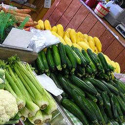
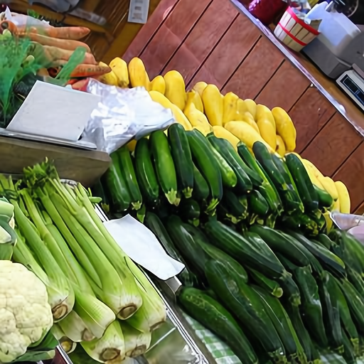

📌 **Image Super-Resolution ISR**

An implementation of Residual Dense Network (RDN) for single image super-resolution using PyTorch.

This project aims to reconstruct high-resolution images from low-resolution inputs, achieving high PSNR and SSIM performance.
## Contents
- [Overview](#overview)
- [Project Structure](#project-structure)
- [Features](#features)
- [Installation](#installation)
- [Usage Examples](#usage-examples)

## Overview
Image super-resolution is a computer vision task that aims to reconstruct a high-resolution (HR) image from its low-resolution (LR) counterpart. This project implements the **Residual Dense Network (RDN)** architecture in PyTorch, a state-of-the-art deep learning model designed for single image super-resolution.

RDN leverages dense connections and residual learning to effectively extract and fuse hierarchical features, leading to superior reconstruction quality. With this implementation, users can train the model from scratch on their own datasets or utilize pre-trained weights for fast inference. 

The project supports multiple scaling factors (e.g., ×2, ×3, ×4) and has been evaluated on standard benchmarks such as DIV2K, Set5, and Set14, achieving competitive PSNR and SSIM scores.
This implementation is inspired by the original paper: [Residual Dense Network for Image Super-Resolution](https://arxiv.org/abs/1802.08797) (Zhang et al. 2018).


## Project Structure
image_super_resolution/

│

├── RDN/ # Thư mục chứa code chính

│ ├── RDN.py # Định nghĩa kiến trúc mô hình

│ ├── imgNet_dataset.py # Xử lý dữ liệu

│ ├── train_RDN.py # Script huấn luyện

│ ├── test_RDN.py # Script kiểm tra

│ └── pycache/ # Cache Python

│

├── weights/ # Thư mục lưu trọng số mô hình

│ └── rdn_x2...pth

│

├── create_LR.py # Tạo ảnh Low-Resolution

├── crop_image.py # Cắt và tiền xử lý ảnh

└── README.md # File mô tả dự án

## Features
- **State-of-the-art architecture** – Implements the [Residual Dense Network (RDN)](https://arxiv.org/abs/1802.08797) for single image super-resolution.
- **Multi-scale support** – Train and test with scaling factors ×2, ×3, ×4.
- **Pre-trained models** – Ready-to-use weights for fast inference.
- **Custom dataset support** – Easily train on your own datasets in addition to standard benchmarks such as DIV2K, Set5, and Set14.
- **Data preprocessing utilities** – Includes scripts for creating low-resolution images (`create_LR.py`) and cropping datasets (`crop_image.py`).
- **Evaluation metrics** – PSNR and SSIM evaluation for quantitative performance comparison.
- **GPU acceleration** – Optimized for CUDA-enabled devices to speed up training and inference.
## Installation
- Install ISR from the GitHub source:
  ```
  git clone https://github.com/cor1211/image_super_resolution.git
  pip install requirements.txt
  ```
# Using
**Prediction**
```
cd RDN/
python test_RDN.py --image_path "your_image_path"
```

